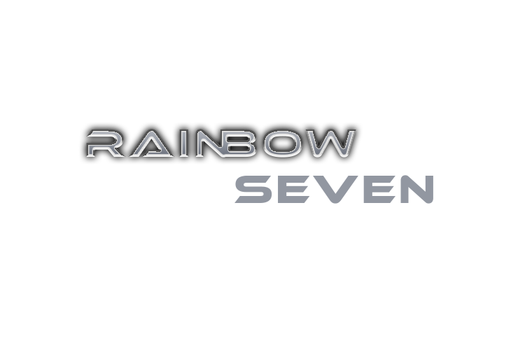

# Rainbow Seven Siege - School Project

This is my school project in Human Computer Interaction Laboratory subject. This is a group project that consists of 4 people. The role of our group is 1 designer, 1 designer and coder, 2 coder.

## Links to This Project
https://aryailham.github.io/rainbowseven-website/

## The Requirements
<ol>
<li>Design a new logo. The logo will be created using Adobe Photoshop, ensure that no layers are merged.</li>
<li>Design the blueprint of your homepage using Adobe Photoshop, Ensure the blueprint that you create matches the website that you will create later.</li>
<li>Provide information about its game, such as lists of maps and operators.</li>
 <li>Create Responsive Website</li>
<li>The website consists of 5 main pages :
  <ul>
   <li>Home</li>
   <li>Operators</li>
   <li>Maps</li>
   <li>Quarantine</li>
   <li>Pre-Order</li>
</ul>
</ol>

## The Blueprints
<a href="Blueprint_home.jpg">Click here to see the blueprint of home<a>

## Descriptions
This project made on June 12, 2020 during semester 4 in university.

## Technologies
▸ HTML 
▸ CSS 
▸ Javascript 
▸ Text Editor: Visual Studio Code

 
